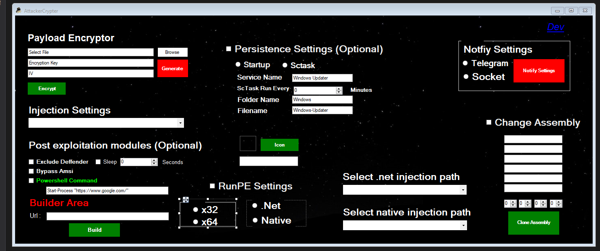
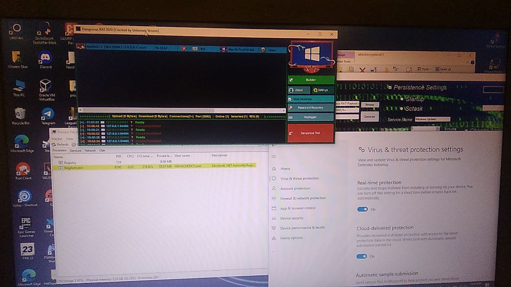

# Theattacker-Crypter
Tool to evade Antivirus With Different Techniques

DO NOT UPLOAD TO VIRUSTOTAL!!!
```
  VirusTotal cooperates with many antiviruses and shares its up-to-date database.
  In order for this crypter to work for a longer time, you must follow this simple rule.
```

# Screenshot




## Updates
- Added AMSI Bypass
- Added RUNPE
- Added support for  32 bit injection
- Added support for 64 bit injection
- Ability to clone Assembly 
- Ability to execute your own Encoded Powershell Commands
- Ability to Disable Amsi even if you are not injecting .Net Paylaod
- Ability to choose Payload type if it Native or .Net 
- Added New injection Paths
- Notify When stub Executed on Macihne 2 Methods Impelmented 
     1. using  Telegrem
     2. using  Socket TCP/IP server
- Fixed SomeBugs 
- New Ui
- Mutex to prevent the process from running Multiple times
- Simple .Net Obfuscator
- Melt Function for the exe to Delete it self after injecting the payload
- [current last version](https://github.com/TheNewAttacker64/Theattacker-Crypter/releases/tag/0.7)

# poc

 

# Usage

1. Download Crypter from Releases
2. choose File and Generate Encryption Key
3. Upload Loader.txt in  raw url Ex(pasteBin)
4. put the url in the build Section and Build

# Detection rate 

 I don t know how much This will stay FUD but will be updating it always and adding New Injection and new Attacks to it 
 
 # HINT 
 
 Simple Note to avoid Detection Completely Use .NET obfuscator like Smart Assembly
 
 # YT-VID
 
 https://www.youtube.com/watch?v=caev1GH8PzE
 
  ## TODO

- [x] Add Ability To execute your own powershell code 
- [x] option To Disable Amsi from powershell 
- [x] Notify Methods When Code executing on Machine
- [x] Mutex to prevent Porcess from running Multiple times
- [x] Delete it self
- [ ] File-Pumper 
- [ ] Loading Payload locally instead of loading our shellcode from url
- [ ] adding Different Encryption Methods 
- [ ] Linux Support

 
 # Support 
 
 Star this Repo if you like the tool
 
 if you want to support any of my work you could donate here 
 
 BTC:1Fzdh15YCAc97Q148VQgLCZYNqoxvp5xKh
 
 
 ETH:0x09519Da68cD67204d81b4fCABF04FdC3e73DFB63
